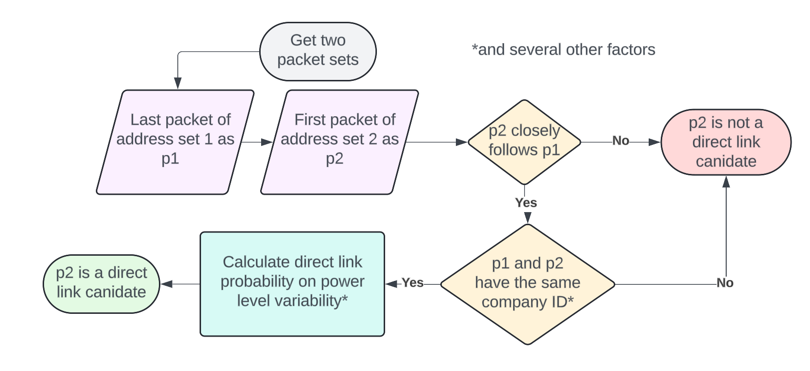

# BLE Research
This project is a POF algorithm that maps groups of BLE packets together as a single device despite MAC address randomization through address time changes as well as device heuristics.

## Setup
0. Ensure Wireshark is installed
1. Create Python env
ex: `python -m venv venv`
2. Activate env
ex: `.\venv\Scripts\activate` 
(windows only)
3. Download dependencies in `requirements.txt`
ex: `pip install -r requirements.txt`
4. Run scripts!
ex: `python main.py path\to\*.pcapng amount_of_packets` 
analyzes given file path and uses amount of packets for progress bar
ex: `python analyze.py` analyzes some test file

